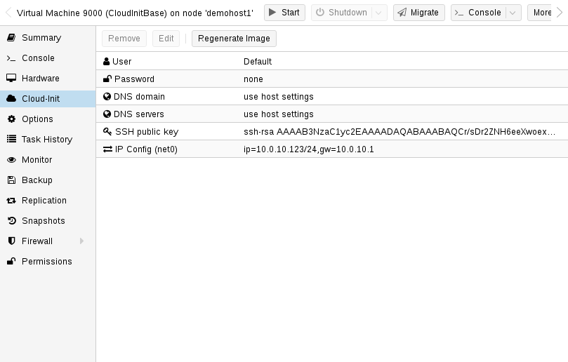
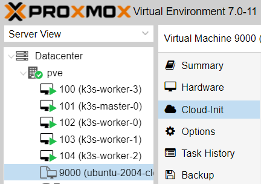

# Build a Kubernetes cluster using k3s on Proxmox via Ansible and Terraform

This is based on the great work that <https://github.com/itwars> done with Ansible, all I left to do is to put it all together with terraform and Proxmox!

## System requirements

* The deployment environment must have Ansible 2.4.0+
* Terraform installed
* Proxmox server

## How to
for updated documentation check out my [medium](https://medium.com/@ssnetanel/build-a-kubernetes-cluster-using-k3s-on-proxmox-via-ansible-and-terraform-c97c7974d4a5).

### Proxmox setup

This setup is relaying on cloud-init images.

Using cloud-init image save us a lot of time and it's work great!
I use ubuntu focal image, you can use whatever distro you like.

to configure the cloud-init image you will need to connect to a Linux server and run the following:

install image tools on the server (you will need another server, these tools cannot be installed on Proxmox)

```bash
apt-get install libguestfs-tools
```

Get the image that you would like to work with.
you can browse to <https://cloud-images.ubuntu.com> and select any other version that you would like to work with.
for Debian, got to <https://cloud.debian.org/images/cloud/>.
it can also work for centos (R.I.P)

```bash
wget https://cloud-images.ubuntu.com/focal/current/focal-server-cloudimg-amd64.img
```

update the image and install Proxmox agent - this is a must if we want terraform to work properly.
it can take a minute to add the package to the image.

```bash
virt-customize focal-server-cloudimg-amd64.img --install qemu-guest-agent
```

now that we have the image, we need to move it to the Proxmox server.
we can do that by using `scp`

```bash
scp focal-server-cloudimg-amd64.img Proxmox_username@Proxmox_host:/path_on_Proxmox/focal-server-cloudimg-amd64.img
```

so now we should have the image configured and on our Proxmox server. let's start creating the VM

```bash
qm create 9000 --name "ubuntu-focal-cloudinit-template" --memory 2048 --net0 virtio,bridge=vmbr0
```

for ubuntu images, rename the image suffix

```bash
mv focal-server-cloudimg-amd64.img focal-server-cloudimg-amd64.qcow2
```

import the disk to the VM

```bash
qm importdisk 9000 focal-server-cloudimg-amd64.qcow2 local-lvm
```

configure the VM to use the new image

```bash
qm set 9000 --scsihw virtio-scsi-pci --scsi0 local-lvm:vm-9000-disk-0
```

add cloud-init image to the VM

```bash
qm set 9000 --ide2 local-lvm:cloudinit
```

set the VM to boot from the cloud-init disk:

```bash
qm set 9000 --boot c --bootdisk scsi0
```

update the serial on the VM

```bash
qm set 9000 --serial0 socket --vga serial0
```

Good! so we are almost done with the image. now we can configure our base configuration for the image.
you can connect to the Proxmox server and go to your VM and look on the cloud-init tab, here you will find some more parameters that we will need to change.



you will need to change the user name, password, and add the ssh public key so we can connect to the VM later using Ansible and terraform.
update the variables and click on `Regenerate Image`

Great! so now we can convert the VM to a template and start working with terraform.

```bash
qm template 9000
```

### terraform setup

our terraform file also creates a dynamic host file for Ansible, so we need to create the files first

```bash
cp -R inventory/sample inventory/my-cluster
```

Rename the file `terraform/variables.tfvars.sample` to `terraform/variables.tfvars` and update all the vars.
there you can select how many nodes would you like to have on your cluster and configure the name of the base image. its also importent to update the ssh key that is going to be used and proxmox host address.
to run the Terrafom, you will need to cd into `terraform` and run:

```bash
cd terraform/
terraform init
terraform plan --var-file=variables.tfvars
terraform apply --var-file=variables.tfvars
```

it can take some time to create the servers on Proxmox but you can monitor them over Proxmox.
it should look like this now:



### Ansible setup
# Automated build of HA k3s Cluster with `kube-vip` and MetalLB


This playbook will build an HA Kubernetes cluster with `k3s`, `kube-vip` and MetalLB via `ansible`.

This is based on the work from [this fork](https://github.com/212850a/k3s-ansible) which is based on the work from [k3s-io/k3s-ansible](https://github.com/k3s-io/k3s-ansible). It uses [kube-vip](https://kube-vip.io/) to create a load balancer for control plane, and [metal-lb](https://metallb.universe.tf/installation/) for its service `LoadBalancer`.

If you want more context on how this works, see:

📄 [Documentation](https://technotim.live/posts/k3s-etcd-ansible/) (including example commands)

📺 [Watch the Video](https://www.youtube.com/watch?v=CbkEWcUZ7zM)

## 📖 k3s Ansible Playbook

Build a Kubernetes cluster using Ansible with k3s. The goal is easily install a HA Kubernetes cluster on machines running:

- [x] Debian (tested on version 11)
- [x] Ubuntu (tested on version 22.04)
- [x] Rocky (tested on version 9)

on processor architecture:

- [X] x64
- [X] arm64
- [X] armhf

## ✅ System requirements

- Control Node (the machine you are running `ansible` commands) must have Ansible 2.11+ If you need a quick primer on Ansible [you can check out my docs and setting up Ansible](https://technotim.live/posts/ansible-automation/).

- You will also need to install collections that this playbook uses by running `ansible-galaxy collection install -r ./collections/requirements.yml` (important❗)

- [`netaddr` package](https://pypi.org/project/netaddr/) must be available to Ansible. If you have installed Ansible via apt, this is already taken care of. If you have installed Ansible via `pip`, make sure to install `netaddr` into the respective virtual environment.

- `server` and `agent` nodes should have passwordless SSH access, if not you can supply arguments to provide credentials `--ask-pass --ask-become-pass` to each command.

## 🚀 Getting Started

### 🍴 Preparation

First create a new directory based on the `sample` directory within the `inventory` directory:

```bash
cp -R inventory/sample inventory/my-cluster
```

Second, edit `inventory/my-cluster/hosts.ini` to match the system information gathered above

For example:

```ini
[master]
192.168.30.38
192.168.30.39
192.168.30.40

[node]
192.168.30.41
192.168.30.42

[k3s_cluster:children]
master
node
```

If multiple hosts are in the master group, the playbook will automatically set up k3s in [HA mode with etcd](https://rancher.com/docs/k3s/latest/en/installation/ha-embedded/).

Finally, copy `ansible.example.cfg` to `ansible.cfg` and adapt the inventory path to match the files that you just created.

This requires at least k3s version `1.19.1` however the version is configurable by using the `k3s_version` variable.

If needed, you can also edit `inventory/my-cluster/group_vars/all.yml` to match your environment.

### ☸️ Create Cluster

Start provisioning of the cluster using the following command:

```bash
ansible-playbook site.yml -i inventory/my-cluster/hosts.ini
```

After deployment control plane will be accessible via virtual ip-address which is defined in inventory/group_vars/all.yml as `apiserver_endpoint`

### 🔥 Remove k3s cluster

```bash
ansible-playbook reset.yml -i inventory/my-cluster/hosts.ini
```

>You should also reboot these nodes due to the VIP not being destroyed

## ⚙️ Kube Config

To copy your `kube config` locally so that you can access your **Kubernetes** cluster run:

```bash
scp debian@master_ip:/etc/rancher/k3s/k3s.yaml ~/.kube/config
```
If you get file Permission denied, go into the node and temporarly run:
```bash
sudo chmod 777 /etc/rancher/k3s/k3s.yaml
```
Then copy with the scp command and reset the permissions back to:
```bash
sudo chmod 600 /etc/rancher/k3s/k3s.yaml
```

You'll then want to modify the config to point to master IP by running:
```bash
sudo nano ~/.kube/config
```
Then change `server: https://127.0.0.1:6443` to match your master IP: `server: https://192.168.1.222:6443`

### 🔨 Testing your cluster

See the commands [here](https://technotim.live/posts/k3s-etcd-ansible/#testing-your-cluster).

### Troubleshooting

Be sure to see [this post](https://github.com/techno-tim/k3s-ansible/discussions/20) on how to troubleshoot common problems

### Testing the playbook using molecule

This playbook includes a [molecule](https://molecule.rtfd.io/)-based test setup.
It is run automatically in CI, but you can also run the tests locally.
This might be helpful for quick feedback in a few cases.
You can find more information about it [here](molecule/README.md).

### Pre-commit Hooks

This repo uses `pre-commit` and `pre-commit-hooks` to lint and fix common style and syntax errors.  Be sure to install python packages and then run `pre-commit install`.  For more information, see [pre-commit](https://pre-commit.com/)

## 🌌 Ansible Galaxy

This collection can now be used in larger ansible projects.

Instructions:

- create or modify a file `collections/requirements.yml` in your project

```yml
collections:
  - name: ansible.utils
  - name: community.general
  - name: ansible.posix
  - name: kubernetes.core
  - name: https://github.com/techno-tim/k3s-ansible.git
    type: git
    version: master
```

- install via `ansible-galaxy collection install -r ./collections/requirements.yml`
- every role is now available via the prefix `techno_tim.k3s_ansible.` e.g. `techno_tim.k3s_ansible.lxc`

## Thanks 🤝

This repo is really standing on the shoulders of giants. Thank you to all those who have contributed and thanks to these repos for code and ideas:

- [k3s-io/k3s-ansible](https://github.com/k3s-io/k3s-ansible)
- [geerlingguy/turing-pi-cluster](https://github.com/geerlingguy/turing-pi-cluster)
- [212850a/k3s-ansible](https://github.com/212850a/k3s-ansible)

### GPU passthrough

# Start NFD - if your cluster doesn't have NFD installed yet
$ kubectl apply -k 'https://github.com/intel/intel-device-plugins-for-kubernetes/deployments/nfd?ref=<RELEASE_VERSION>'

# Create NodeFeatureRules for detecting GPUs on nodes
$ kubectl apply -k 'https://github.com/intel/intel-device-plugins-for-kubernetes/deployments/nfd/overlays/node-feature-rules?ref=<RELEASE_VERSION>'

# Create GPU plugin daemonset
$ kubectl apply -k 'https://github.com/intel/intel-device-plugins-for-kubernetes/deployments/gpu_plugin/overlays/monitoring_shared-dev_nfd/?ref=<RELEASE_VERSION>'